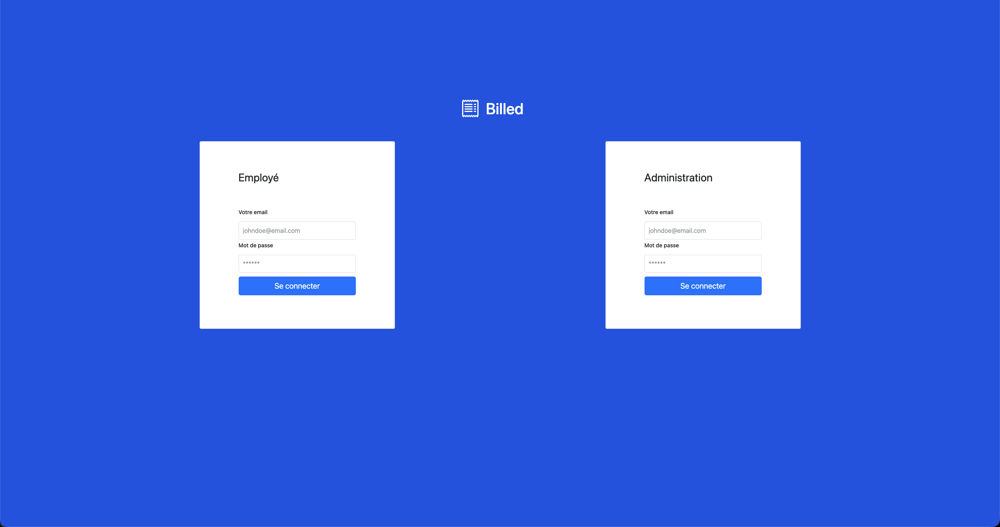

# 🧾 OC-Billed

<p align="center"></p>

<p align="center">
  
  
  
  
  
  
  
  
  
</p>

**OC-Billed** is a web expense management application,
developed as part of the **OpenClassrooms Frontend Developer** curriculum.

It allows employees to submit their expense reports
and administrators to view and manage them via a dedicated interface.

---

## Quick overview

- Employee / administrator authentication
- Creation and tracking of expense reports
- Upload of receipts (images)
- Administrator dashboard
- API error handling (404 / 500)
- Framework-free SPA application

---

## GitHub repository

- [Main branch](https://github.com/Steinshy/Oc-Billed)

---

## Project structure

```text
Oc-Billed/
├── index.html
├── src/
│   ├── App.js
│   ├── api/
│   │   ├── api.js
│   │   ├── entity.js
│   │   └── store.js
│   ├── components/
│   │   ├── bills/
│   │   ├── dashboard/
│   │   ├── login/
│   │   └── error/
│   ├── middleware/
│   │   ├── router.js
│   │   ├── routes.js
│   │   └── path.js
│   ├── utils/
│   └── data/
├── styles/
├── public/
├── test/
└── dist/
```

---

## Technologies

### Frontend
- **JavaScript ES6+** — Framework‑free SPA
- **Semantic HTML5**
- **Modular CSS**

### Tooling & Quality
- **Jest** + **Testing Library** — unit & integration tests
- **ESLint** — JavaScript linting
- **Prettier** — code formatting
- **Stylelint** — CSS linting
- **Live Server** — development server

### Environment
- **Node.js** ≥ 18
- **npm**

---

## Main features

### Employee
- Secure login
- Viewing expense reports
- Creating an expense report
- Uploading receipt (jpg, jpeg, png)
- Viewing receipt (modal)

### Administrator
- Access to global dashboard
- Viewing all expense reports

---

## Accessibility

- Full keyboard navigation
- Semantic HTML structure
- Clear error messages
- Accessible modals
- WCAG best practices compliance

---

## Tests

- Unit and integration tests with **Jest**
- Mock store and localStorage
- Router and component tests

```bash
npm test
```

---

## Getting started

### Installation

```bash
git clone https://github.com/Steinshy/Oc-Billed.git
cd Oc-Billed
npm install
```

### Development

```bash
npm run dev
```

---

## Available scripts

| Command           | Description             |
| ----------------- | ----------------------- |
| `npm run dev`     | Runs the frontend       |
| `npm run dev:all` | Runs frontend + backend |
| `npm run build`   | Production build        |
| `npm run preview` | Preview                 |
| `npm test`        | Runs tests              |
| `npm run lint`    | Lints the project       |

---

## Configuration

- JWT storage via `localStorage`
- Role-based protected routes
- Centralized API calls via `store.js`

---

## Compatibility

- Modern browsers (Chrome, Firefox, Edge)
- Node.js ≥ 18

---

## License

Project developed as part of the
**OpenClassrooms Frontend Developer** curriculum.

© 2025 — OC-Billed
