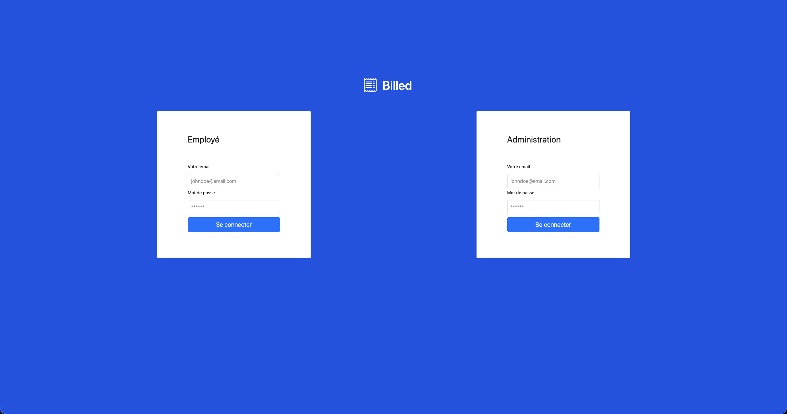

# 🧾 OC-Billed

<p align="center"></p>

<p align="center">
  
  
  
  
  
  
  
  
  
</p>

**OC-Billed** est une application web de gestion de notes de frais,  
développée dans le cadre du parcours **Développeur Frontend OpenClassrooms**.

Elle permet aux employés de soumettre leurs notes de frais  
et aux administrateurs de les consulter et de les gérer via une interface dédiée.

---

## Aperçu rapide

- Authentification employé / administrateur
- Création et suivi des notes de frais
- Upload de justificatifs (images)
- Tableau de bord administrateur
- Gestion des erreurs API (404 / 500)
- Application SPA sans framework

---

## Dépôt GitHub

- [Branche principale](https://github.com/Steinshy/Oc-Billed)

---

## Structure du projet

```text
OC-Billed/                  # Workspace pnpm
├── package.json            # Scripts racine (dev, test, lint…)
├── pnpm-workspace.yaml
├── Backend/                # API Express + Sequelize (SQLite)
│   ├── server.js           # Point d'entrée (port 5678)
│   ├── app.js              # Application Express
│   ├── controllers/        # auth, bill, user
│   ├── routes/             # /auth, /bills, /users
│   ├── middlewares/        # Authentification JWT
│   ├── models/             # Modèles Sequelize (User, Bill)
│   ├── migrations/         # Migrations base de données
│   ├── services/           # jwt, password (bcrypt)
│   └── tests/              # Tests d'intégration (supertest)
└── Frontend/               # SPA JavaScript sans framework
    ├── index.html
    └── src/
        ├── app/            # Router, Store (API), format
        ├── containers/     # Logique : Bills, NewBill, Login, Dashboard…
        ├── views/          # Rendu HTML des pages
        ├── constants/      # Routes, utilisateurs de test
        └── __tests__/      # Tests Jest + Testing Library
```

---

## Technologies

### Frontend
- **JavaScript ES6+** — SPA sans framework
- **HTML5 sémantique**
- **CSS modulaire**

### Outils & Qualité
- **Jest** + **Testing Library** — tests unitaires et d’intégration
- **ESLint** — lint JavaScript
- **Prettier** — formatage du code
- **Stylelint** — lint CSS
- **Live Server** — serveur de développement

### Environnement
- **Node.js** ≥ 22
- **pnpm** ≥ 10

---

## Fonctionnalités principales

### Employé
- Connexion sécurisée
- Consultation des notes de frais
- Création d’une note de frais
- Upload de justificatif (jpg, jpeg, png)
- Visualisation d’un justificatif (modale)

### Administrateur
- Accès au tableau de bord global
- Consultation de toutes les notes de frais

---

## Accessibilité

- Navigation clavier complète
- Structure HTML sémantique
- Messages d’erreur clairs
- Modales accessibles
- Respect des bonnes pratiques WCAG

---

## Tests

- Tests unitaires et intégration avec **Jest**
- Mock du store et du localStorage
- Tests du router et des composants

```bash
pnpm test
```

---

## Démarrage

### Installation

```bash
git clone https://github.com/Steinshy/Oc-Billed.git
cd Oc-Billed
pnpm install
```

### Développement

```bash
pnpm seed   # première fois : migrations + données de démo
pnpm dev    # lance backend (5678) + frontend (live-server)
```

---

## Scripts disponibles (racine)

| Commande            | Description                      |
| ------------------- | -------------------------------- |
| `pnpm dev`          | Backend + frontend en parallèle  |
| `pnpm dev:backend`  | Backend seul (port 5678)         |
| `pnpm dev:frontend` | Frontend seul (live-server)      |
| `pnpm seed`         | Migrations + données de démo     |
| `pnpm test`         | Tests des deux packages          |
| `pnpm lint`         | Lint des deux packages           |
| `pnpm format`       | Formatage Prettier               |

---

## Configuration

- Stockage JWT via `localStorage`
- Routes protégées selon le rôle
- Appels API centralisés via `store.js`

---

## Compatibilité

- Navigateurs modernes (Chrome, Firefox, Edge)
- Node.js ≥ 22

---

## Licence

Projet réalisé dans le cadre du parcours  
**Développeur Frontend OpenClassrooms**.

© 2025 — OC-Billed
